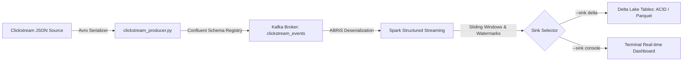

# Real-Time Clickstream Aggregation Pipeline

This project implements a scalable real-time streaming pipeline for clickstream analytics, architected with enterprise monorepo standards.

## Architecture



### Key Highlights
- **Schema Governance:** Confluent Schema Registry validates and enforces the Avro schema contract (`schemas/clickstream_event.avsc`).
- **Low-Latency Ingestion:** Avro serialized stream produced to Kafka using `confluent-kafka`.
- **PySpark Structured Streaming & ABRiS:** Dynamic schema downloading and Avro deserialization via the Py4J gateway.
- **Stateful Event-Time Aggregations:** Sliding window calculations (`window_duration: 10s`, `slide_duration: 5s`) with late-data handling using watermarks (`watermark_delay: 10s`).
  1. **URL Click Metrics:** Grouped by time window, URL path, and action event type.
  2. **Active User Activity:** Grouped by time window and user ID to track user engagement.
- **Lakehouse ACID Storage:** Curated real-time tables written directly into Delta Lake with checkpoint recovery and time-travel metadata.

---

## Directory Structure

```text
projects/realtime/clickstream/
├── BUILD                                   # Pants build definitions
├── README.md                               # Project documentation
├── config/
│   └── clickstream_config.yml              # Pipeline configuration
├── schemas/
│   └── clickstream_event.avsc              # Avro schema contract
├── input_data/
│   └── clickstream_events.json             # Clickstream sample dataset
├── clickstream_producer.py                 # Confluent Avro event producer
└── clickstream_aggregation_job.py          # PySpark Streaming & Delta Lake aggregation job
```

---

## Quickstart & Execution

### 1. Start Infrastructure (Kafka, Zookeeper, Schema Registry)
Make sure the shared Kafka container stack from `projects/common/docker` is up:
```bash
docker compose -f projects/common/docker/docker-compose.yml up -d
```

### 2. Produce Clickstream Events to Kafka
Run the Avro producer using Pants:
```bash
./pants run projects/realtime/clickstream:producer
```

### 3. Run the Streaming Aggregation Pipeline

#### Debug / Real-time Console Mode:
```bash
./pants run projects/realtime/clickstream:stream_job -- --sink console
```

#### Production Lakehouse Mode (Delta Lake):
```bash
./pants run projects/realtime/clickstream:stream_job -- --sink delta
```

#### One-off Batch Evaluation:
```bash
./pants run projects/realtime/clickstream:stream_job -- --batch --sink console
```
