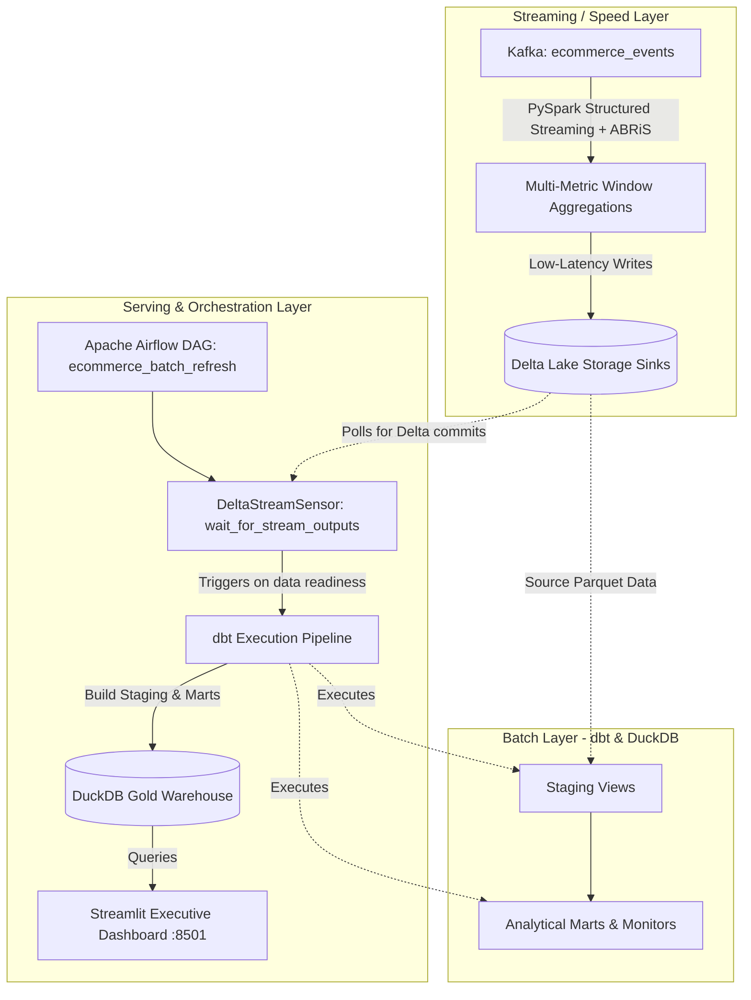

# E-Commerce Real-Time Lambda Architecture & Orchestration

This project implements a complete **Lambda Architecture** for high-volume e-commerce intelligence, combining real-time streaming, batch layer curation, and automated Airflow orchestration with interactive executive dashboards.



---

## 📁 Project Architecture & Components

*   [projects/common/docker/docker-compose.yml](../../common/docker/docker-compose.yml): Shared monorepo Zookeeper, Kafka, and Confluent Schema Registry (`:8081`) containers.

### 1. Speed Layer (`streaming_layer/`)
*   [config/ecommerce_config.yml](streaming_layer/config/ecommerce_config.yml): Configuration defining Kafka topics, Schema Registry URL, sliding windows (`10s` duration, `5s` slide), `10s` watermark, and Delta Lake sinks.
*   [schemas/ecommerce_event.avsc](streaming_layer/schemas/ecommerce_event.avsc): Avro schema contract supporting `user_id`, `url`, `event_type`, `product_id`, `category`, `price`, and device headers.
*   [aggregations.py](streaming_layer/aggregations.py): Real-time metrics computation:
    - **URL Click Counts & User Engagement:** Event-time windowed activity tracking.
    - **URL Conversion Rate:** `purchases / views` per URL.
    - **Category Revenue & Units:** Sales metrics grouped by category.
    - **Cart Metrics:** `add_to_cart_rate` and `cart_abandonment`.
    - **Session Funnels:** 15-min session windowing tracking `view -> add_to_cart -> purchase`.
    - **Top-N URLs per User:** Ranked visit counts per user.
*   [sinks.py](streaming_layer/sinks.py): Modular streaming and batch writer adapters for Delta Lake and Console outputs.
*   [ecommerce_producer.py](streaming_layer/ecommerce_producer.py): Lightweight Avro event producer.
*   [ecommerce_aggregation_job.py](streaming_layer/ecommerce_aggregation_job.py): PySpark streaming orchestrator.

### 2. Batch Layer (`batch_layer/`)
*   [dbt_project.yml](batch_layer/dbt_project.yml) & [profiles.yml](batch_layer/profiles.yml): dbt configuration targeting DuckDB (`ecommerce.duckdb`).
*   [Makefile](batch_layer/Makefile): Shortcuts for dbt execution (`make dbt-build`, `make query`).
*   [macros/](batch_layer/macros/): Centralized SQL macros (`get_stream_path.sql` for dynamic parquet source resolution).
*   [models/staging/](batch_layer/models/staging/): Staging views over streaming Delta/Parquet outputs with schema integrity tests.
*   [models/marts/](batch_layer/models/marts/): Analytical models (`cumulative_users`, `daily_category_sales`, `monthly_category_sales`, `daily_top_urls`, `daily_top_urls_per_user`, `daily_url_conversion`, `new_vs_returning_users`).
*   [models/monitors/](batch_layer/models/monitors/): Freshness and latency monitor (`last_ingest.sql`).

### 3. Orchestration & Serving Layer (`orchestration/`)
*   [docker-compose.yml](orchestration/docker-compose.yml): Airflow (LocalExecutor), PostgreSQL backend, and Streamlit containers.
*   [Makefile](orchestration/Makefile): Cluster lifecycle commands (`make up`, `make down`, `make logs`).
*   [dags/ecommerce_pipeline.py](orchestration/dags/ecommerce_pipeline.py): Airflow DAG using a custom `DeltaStreamSensor` (`wait_for_stream_outputs`) with reschedule mode to poll stream arrival, orchestrating `dbt build` and `dbt test`.
*   [viz/app.py](orchestration/viz/app.py): Interactive Streamlit dashboard visualizer (`:8501`) with cached DuckDB queries.

---

## 🚀 Quickstart & Execution

### 1. Start Shared Kafka Infrastructure
```bash
docker compose -f projects/common/docker/docker-compose.yml up -d
```

### 2. Stream E-Commerce Events to Kafka
```bash
./pants run projects/realtime/ecommerce/streaming_layer:producer
```

### 3. Run the Real-Time Streaming Aggregator
```bash
# Streaming mode (continuous execution with Delta Lake sinks)
./pants run projects/realtime/ecommerce/streaming_layer:stream_job -- --sink delta

# Batch mode (immediate single-pass execution for quick testing)
./pants run projects/realtime/ecommerce/streaming_layer:stream_job -- --batch --sink delta
```

### 4. Execute Batch Transformations via dbt (Optional Standalone)
```bash
cd projects/realtime/ecommerce/batch_layer
make build      # Builds the local dbt container
make dbt-build  # Runs dbt models and tests against DuckDB
make query      # Interactive DuckDB CLI on data/ecommerce.duckdb
```

### 5. Launch Orchestration & Dashboard Cluster
> **Prerequisite:** Ensure `AIRFLOW_FERNET_KEY` is present in your local `.env` file (e.g. `AIRFLOW_FERNET_KEY=IOYiXlIcJ8QVhBT2iVyuKc2ehyX7OcBt-_f1EPDyNqM=`).

```bash
cd projects/realtime/ecommerce/orchestration
make build  # Builds Airflow & Streamlit container images
make up     # Starts Airflow, Postgres, and Streamlit in background
make status # Checks container health status
```
- **Airflow Webserver UI:** `http://localhost:8080` (`admin` / `admin`)
- **Streamlit Dashboard:** `http://localhost:8501`

To stop all orchestration services:
```bash
make down
```
