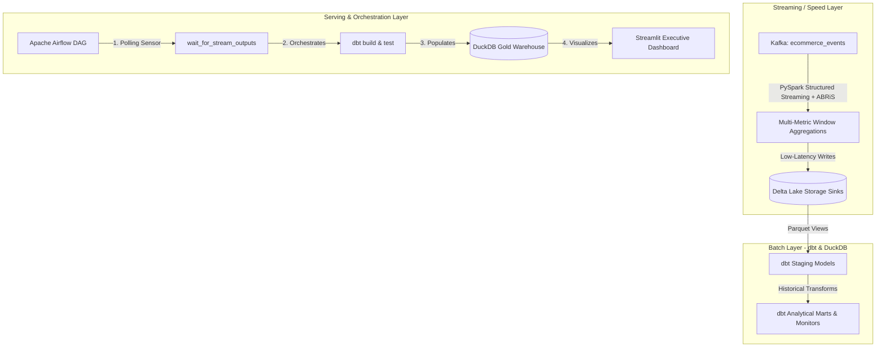

# E-Commerce Real-Time Lambda Architecture & Orchestration

This project implements a complete **Lambda Architecture** for high-volume e-commerce intelligence, combining real-time streaming, batch layer curation, and automated Airflow orchestration with interactive executive dashboards.



---

## 📁 Project Architecture & Components

*   [projects/common/docker/docker-compose.yml](projects/common/docker/docker-compose.yml): Shared monorepo Zookeeper, Kafka, and Confluent Schema Registry (`:8081`) containers.

### 1. Speed Layer (`streaming_layer/`)
*   [config/ecommerce_config.yml](projects/realtime/ecommerce/streaming_layer/config/ecommerce_config.yml): Configuration defining Kafka topics, Schema Registry URL, sliding windows (`10s` duration, `5s` slide), `10s` watermark, and Delta Lake sinks.
*   [schemas/ecommerce_event.avsc](projects/realtime/ecommerce/streaming_layer/schemas/ecommerce_event.avsc): Avro schema contract supporting `user_id`, `url`, `event_type`, `product_id`, `category`, `price`, and device headers.
*   [aggregations.py](projects/realtime/ecommerce/streaming_layer/aggregations.py): Real-time metrics computation:
    - **URL Conversion Rate:** `purchases / views` per URL.
    - **Category Revenue & Units:** Sales metrics grouped by category.
    - **Cart Metrics:** `add_to_cart_rate` and `cart_abandonment`.
    - **Session Funnels:** 15-min session windowing tracking `view -> add_to_cart -> purchase`.
    - **Top-N URLs per User:** Ranked visit counts per user.
*   [sinks.py](projects/realtime/ecommerce/streaming_layer/sinks.py): Modular streaming and batch writer adapters for Delta Lake and Console outputs.
*   [ecommerce_producer.py](projects/realtime/ecommerce/streaming_layer/ecommerce_producer.py): Lightweight Avro event producer.
*   [ecommerce_aggregation_job.py](projects/realtime/ecommerce/streaming_layer/ecommerce_aggregation_job.py): PySpark streaming orchestrator.

### 2. Batch Layer (`batch_layer/`)
*   [dbt_project.yml](projects/realtime/ecommerce/batch_layer/dbt_project.yml) & [profiles.yml](projects/realtime/ecommerce/batch_layer/profiles.yml): dbt configuration targeting DuckDB (`ecommerce.duckdb`).
*   [Makefile](projects/realtime/ecommerce/batch_layer/Makefile): Shortcuts for dbt execution (`make dbt-build`, `make query`).
*   [models/staging/](projects/realtime/ecommerce/batch_layer/models/staging/): Staging views over streaming Delta/Parquet outputs.
*   [models/marts/](projects/realtime/ecommerce/batch_layer/models/marts/): Analytical models (`cumulative_users`, `daily_category_sales`, `monthly_category_sales`, `daily_top_urls`, `daily_top_urls_per_user`, `daily_url_conversion`, `new_vs_returning_users`).
*   [models/monitors/](projects/realtime/ecommerce/batch_layer/models/monitors/): Freshness and latency monitor (`last_ingest.sql`).

### 3. Orchestration & Serving Layer (`orchestration/`)
*   [docker-compose.yml](projects/realtime/ecommerce/orchestration/docker-compose.yml): Airflow (LocalExecutor), PostgreSQL backend, and Streamlit containers.
*   [Makefile](projects/realtime/ecommerce/orchestration/Makefile): Cluster lifecycle commands (`make up`, `make down`, `make logs`).
*   [dags/ecommerce_pipeline.py](projects/realtime/ecommerce/orchestration/dags/ecommerce_pipeline.py): DAG polling stream arrival and running dbt transformations and data tests.
*   [viz/app.py](projects/realtime/ecommerce/orchestration/viz/app.py): Interactive Streamlit dashboard visualizer (`:8501`).

---

## 🚀 Quickstart & Execution

### 1. Start Shared Kafka Infrastructure
```bash
docker compose -f projects/common/docker/docker-compose.yml up -d
```

### 2. Stream E-Commerce Events to Kafka
```bash
./pants run projects/realtime/ecommerce/streaming_layer:producer
```

### 3. Run the Real-Time Streaming Aggregator
```bash
./pants run projects/realtime/ecommerce/streaming_layer:stream_job -- --sink delta
```

### 4. Execute Batch Transformations via dbt (Optional Standalone)
```bash
cd projects/realtime/ecommerce/batch_layer
make dbt-build
make query
```

### 5. Launch Orchestration & Dashboard Cluster
```bash
cd projects/realtime/ecommerce/orchestration
make up
```
- **Airflow UI:** `http://localhost:8080` (admin / admin)
- **Streamlit Dashboard:** `http://localhost:8501`
