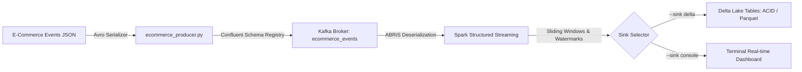

# Real-Time E-Commerce Streaming Layer

This sub-project implements the real-time speed layer of the e-commerce platform using PySpark Structured Streaming, Confluent Schema Registry (via ABRiS), and Delta Lake.

## Architecture



### Key Highlights
- **Schema Governance:** Confluent Schema Registry validates and enforces the Avro schema contract (`schemas/ecommerce_event.avsc`).
- **Low-Latency Ingestion:** Avro-serialized stream produced to Kafka using `confluent-kafka`.
- **PySpark Structured Streaming & ABRiS:** Dynamic schema downloading and Avro deserialization via the Py4J gateway.
- **Stateful Event-Time Aggregations:** Sliding window calculations (`window_duration: 10s`, `slide_duration: 5s`) with late-data handling using watermarks (`watermark_delay: 10s`):
  1. **URL Click Counts:** Event-time windowed activity by URL and interaction type.
  2. **Active User Activity:** Sliding window event counts grouped by user ID.
  3. **URL Conversion Rate:** Real-time purchases divided by views per URL.
  4. **Category Revenue & Volume:** Real-time gross sales and units sold per product category.
  5. **Cart Metrics:** Add-to-cart rates and cart abandonment rates.
  6. **Session Funnels:** 15-minute session windows tracking `view -> add_to_cart -> purchase` progression.
  7. **Top URLs per User:** Ranked visit frequency per user.
- **Lakehouse ACID Storage:** Curated real-time tables written directly into Delta Lake sinks (`projects/realtime/ecommerce/output_data`) with checkpoint recovery and ACID transactions.

---

## 📁 Project Structure

*   [projects/common/docker/docker-compose.yml](../../../common/docker/docker-compose.yml): Shared monorepo Zookeeper, Kafka, and Confluent Schema Registry (`:8081`) containers.
*   [config/ecommerce_config.yml](config/ecommerce_config.yml): Configuration defining Kafka parameters, Schema Registry endpoint, watermarking, sliding windows, and Delta Lake sinks.
*   [schemas/ecommerce_event.avsc](schemas/ecommerce_event.avsc): Avro schema contract for e-commerce interaction and purchase events.
*   [input_data/ecommerce_events.json](input_data/ecommerce_events.json): Sample raw e-commerce event stream dataset.
*   [aggregations.py](aggregations.py): Stateful event-time windowing, session funnels, and metric aggregations.
*   [sinks.py](sinks.py): Modular streaming and batch sink writers (Delta Lake and Console).
*   [ecommerce_producer.py](ecommerce_producer.py): Confluent Avro event producer.
*   [ecommerce_aggregation_job.py](ecommerce_aggregation_job.py): PySpark Structured Streaming pipeline orchestrator.
*   [BUILD](BUILD): Pants build definitions (`lib`, `data_files`, `producer`, `stream_job`).

```text
projects/realtime/ecommerce/streaming_layer/
├── BUILD                            # Pants build definitions
├── README.md                        # Streaming layer documentation
├── config/
│   └── ecommerce_config.yml         # Pipeline configuration
├── schemas/
│   └── ecommerce_event.avsc         # Avro schema contract
├── input_data/
│   └── ecommerce_events.json        # E-commerce sample dataset
├── aggregations.py                  # Spark window aggregations & KPIs
├── sinks.py                         # Delta & Console sink writers
├── ecommerce_producer.py            # Confluent Avro event producer
└── ecommerce_aggregation_job.py     # Pipeline entry point & orchestrator
```

---

## 🚀 Quickstart & Execution

### 1. Start Infrastructure (Kafka, Zookeeper, Schema Registry)
Make sure the shared Kafka container stack from `projects/common/docker` is running:
```bash
docker compose -f projects/common/docker/docker-compose.yml up -d
```

### 2. Produce E-Commerce Events to Kafka
Run the Avro producer using Pants:
```bash
./pants run projects/realtime/ecommerce/streaming_layer:producer
```

### 3. Run the Streaming Aggregation Pipeline

#### Debug / Real-time Console Mode:
```bash
./pants run projects/realtime/ecommerce/streaming_layer:stream_job -- --sink console
```

#### Production Lakehouse Mode (Delta Lake):
```bash
./pants run projects/realtime/ecommerce/streaming_layer:stream_job -- --sink delta
```

#### One-off Batch Evaluation:
```bash
./pants run projects/realtime/ecommerce/streaming_layer:stream_job -- --batch --sink delta
```
